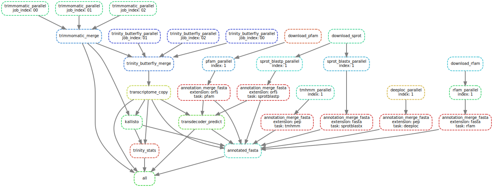

# transXpress-snakemake
transXpress: a [Snakemake](https://snakemake.readthedocs.io/en/stable/) pipeline for rapid de novo transcriptome assembly and annotation

Also see our sister project: [transXpress-nextflow](https://github.com/transXpress/transXpress-nextflow)

## Intro

## Dependencies

transXpress requires:
* snakemake 5.4.2+ (install via conda)
* fastqc (install via conda)
* trimmomatic (install via conda)
* Trinity (install via conda)
* SPAdes (install via conda)
* TransDecoder (install via conda)
* BioPython (install via conda)
* samtools (install via conda)
* bowtie2 (install via conda)
* infernal (install via conda)
* HMMER (install via conda)
* kallisto (install via conda)
* NCBI BLAST+ (install via conda)
* R (install via conda)
* edgeR (install via conda)
* seqkit (install via conda)
* wget (install via conda)
* tidyverse (required for Trinity, install via conda)
* python 3.6, numpy 1.16, scipy 1.0, theano 1.0.1, six 1.11 (required for deeploc, install via conda)
* [deeploc](https://services.healthtech.dtu.dk/service.php?DeepLoc-1.0)
* [targetp 2.0](http://www.cbs.dtu.dk/services/TargetP/)
* tmhmm.py (install via pip)
* basic Linux utitilies: split, awk, cut, gzip

## Installation

1. Install [Miniconda3](https://conda.io/en/latest/miniconda.html)

2. Setup conda environment (optional):
~~~~
conda create --name transxpress
conda activate transxpress
~~~~

3. Install snakemake and other dependencies:  
~~~~
conda config --add channels bioconda
conda config --add channels conda-forge
conda config --set channel_priority false
conda install "snakemake>=5" fastqc transdecoder samtools infernal hmmer kallisto blast=2.10 seqkit wget
conda install r bioconductor-edger r-tidyverse 
conda install "trinity>=2.11" trimmomatic bowtie2 "python>=3.6" biopython numpy=1.16 scipy=1.0 theano=1.0.1 six==1.11 parallel spades
~~~~
4. Install deeploc:
      * Download deeploc from https://services.healthtech.dtu.dk/service.php?DeepLoc-1.0 (go to Downloads)
      * Install deeploc: 
        ~~~~
         pip install git+https://github.com/Lasagne/Lasagne.git#egg=Lasagne-0.2.dev1 (other requirements for deeploc are already installed via conda)
         python setup.py install
        ~~~~
        (make sure the conda python is used, or use the full path to python from your conda installation)
5. Install targetp 2.0:
      * Download targetp 2.0 from http://www.cbs.dtu.dk/services/TargetP/ (go to Portable version)
      * add path to targetp /bin/ folder to the PATH variable
6. Install [tmhmm.py](https://github.com/dansondergaard/tmhmm.py) via pip:
~~~~
pip install tmhmm.py
~~~~

7. Checkout the transXpress code into the folder in which you will be performing your assembly:
~~~~
git clone https://github.com/transXpress/transXpress-snakemake.git .
~~~~

## Input

Create a tab-separated file called *samples.txt* with the following contents:
~~~
cond_A    cond_A_rep1    A_rep1_left.fq    A_rep1_right.fq
cond_A    cond_A_rep2    A_rep2_left.fq    A_rep2_right.fq
cond_B    cond_B_rep1    B_rep1_left.fq    B_rep1_right.fq
cond_B    cond_B_rep2    B_rep2_left.fq    B_rep2_right.fq
~~~

Also take a look at the configuration file *config.yaml* and update as required.

## Running transXpress

Use the provided script:
~~~~
./transXpress.sh
~~~~

Or run snakemake manually with 10 local threads:
~~~~
snakemake --cores 10 --config samples_file=samples_file.txt
~~~~

Or run snakemake manually on an LSF cluster:
~~~~
snakemake --latency-wait 60 --jobs 10000 --cluster 'bsub -n {threads} -R "rusage[mem={params.memory}000] span[hosts=1]" -oo {log}.bsub'
~~~~

## Running tests
~~~~
cd tests
./run_test.sh
~~~~

## Flow

